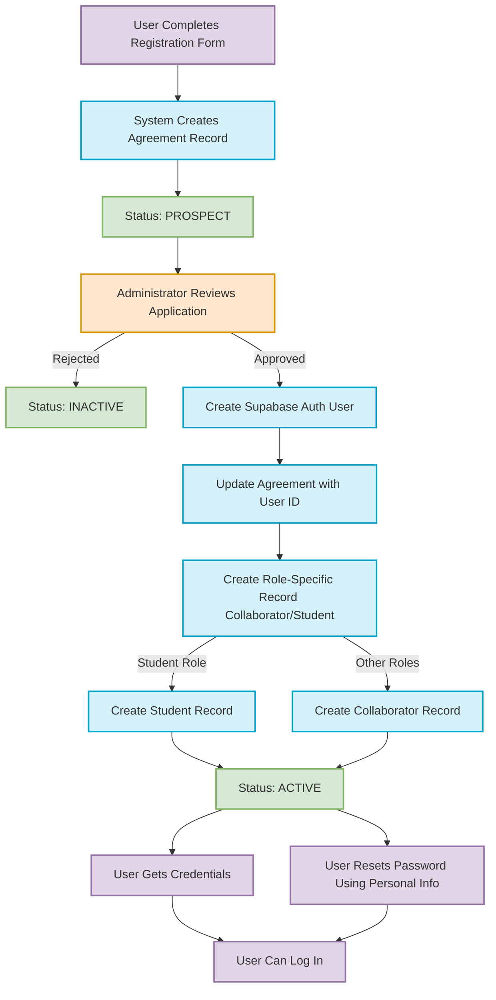

# Akademia Registration Process Guide

## Step-by-Step Registration Process

### 1. Initial Registration
- **User Action**: Completes the registration form with:
  - Personal details (name, email, document number, phone)
  - Selected headquarters and role
  - Current headquarter season will be assigned
  - Agreement consents (volunteering, ethical document, etc.)
  - Digital signature
- **System Action**: Creates an `agreements` record with:
  - Status set to `prospect`
  - All personal information fields populated
  - Role, headquarter,season, and agreement fields set
  - No user_id (these remain NULL)

### 2. Administrative Review
- **Admin Action**: Reviews the prospect registration application
- **Admin Decision**: Approve or reject the application
  - If rejected: Agreement status is set to `inactive`
  - If approved: Process continues to account creation

### 3. Account Creation
- **System Action**: Creates a Supabase auth user account
  - Uses the email from the agreement record
  - Sets a secure initial password
- **System Action**: Updates the agreement record:
  - Links the new `user_id` to the agreement
  - Assigns appropriate `season_id`
  - Updates other necessary fields

### 4. Role-Based Record Creation
- **System Action**: Based on the user's role, creates:
  - **For students**: Record in the `students` table
  - **For collaborators**: Record in the `collaborators` table
  - **For konsejo members**: Records in both `collaborators` and `konsejo_members` tables
- **System Action**: Sets agreement status to `active`

### 5. Credential Delivery (Two Options)
- **Option 1: In-Person Delivery**
  - Administrator provides login credentials directly to the user
  - We may use in mail delivery in MVP2
  
- **Option 2: Self-Service Password Reset**
  - User uses a "forgot password" feature
  - Validates identity using their:
    - Document number
    - Email
    - Phone number
  - Sets their own password

### 6. System Access
- User can now log in to the system
- Access is granted based on their role permissions

 

